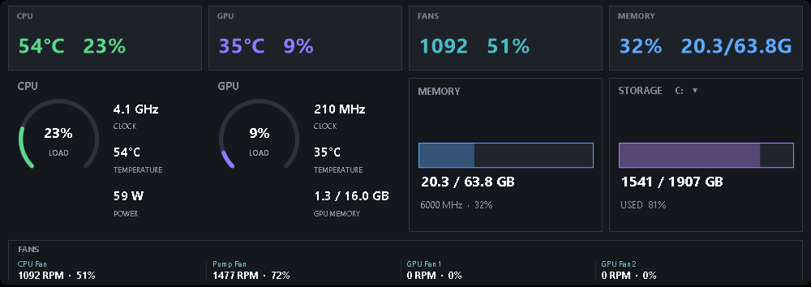
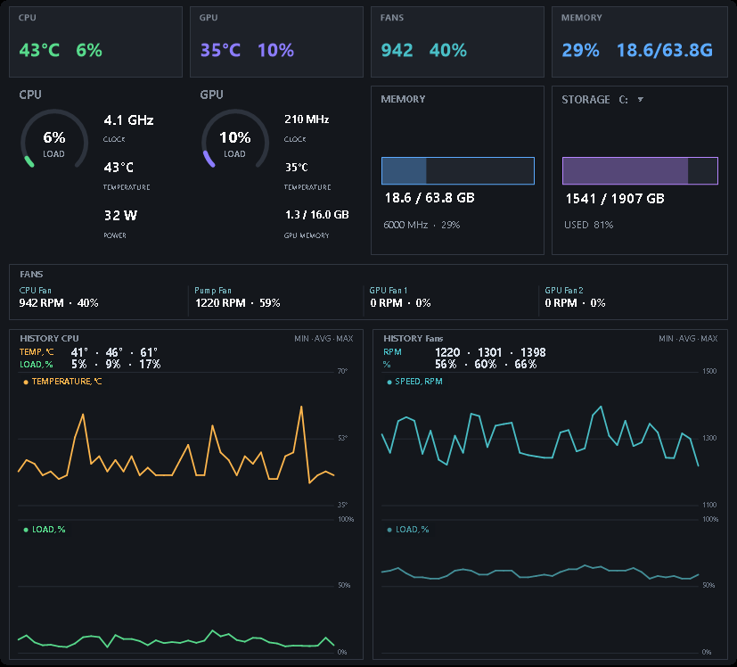

# Traymetry

**A compact hardware monitor for Windows that stays out of the way.**
FPS, temperatures, CPU and GPU load, memory, disks and network — over a game or
on a second monitor. One file, no installer, no vendor utility.

[**Download the latest build**](https://github.com/Alsoilia/Traymetry/releases)
· [Русская версия](README.ru.md)


Free and open source, MIT licensed.

## What it shows

- **FPS** of the game or application in the foreground.
- **CPU** — temperature, load, clock and power, where the sensors allow it.
- **GPU** — temperature, load, clock, power and video memory in use.
- **Memory** — how much is taken and at what clock the modules run.
- **Disks** — space used, with a choice of which drive to watch.
- **Network** — current download and upload rate.

CPU and GPU readings come from the open-source LibreHardwareMonitor; memory,
disks and network traffic also come from standard Windows APIs. Traymetry does
not attach itself to any vendor's software and needs none of it installed.



## The point of it

A monitor you keep on screen has to earn the space it takes. Traymetry scales
from a single number to a full panel, and everything about it — size, position,
opacity, which readings appear, whether it has a background at all — is meant to
be changed in a second and then forgotten.


- Drag the edges or corners to resize. Cards rearrange themselves by priority:
  CPU → GPU → memory → network.
- **Pinned** takes the widget out of the way of the mouse entirely: clicks pass
  straight through to the game underneath, while a right or middle click over it
  still reaches the widget.
- The `%` button opens an opacity slider; the background button drops the
  backing plate; the bottom strip expands to the full panel and returns to the
  exact size and position it had before.
- The triangle hides it in the notification area.
- It does not appear in `Alt+Tab`, cannot be lost past the edge of a monitor,
  and moves freely between screens.

Size, position, opacity, the no-background mode, the pin and the state of the
top bar all survive a restart.

Expanded the whole way, it keeps a history of what it has been reading:



## Running it

A finished build is one file, `Traymetry.exe` — the sensor library and its
dependencies are inside it. It needs 64-bit Windows 10 or 11 on an Intel or AMD
processor, with .NET Framework 4.7.2 or newer.

For low-level CPU sensors, LibreHardwareMonitor 0.9.6 uses the PawnIO driver.
Without it, CPU temperature and power may be unavailable no matter what rights
Traymetry runs with. On first run Traymetry explains what the driver is for and,
only after explicit consent, downloads the official signed installer from the
PawnIO 2.2.0 GitHub Release and runs it through UAC. A pinned SHA-256 and the
publisher's certificate are both checked before anything is started. **The
installer is not bundled inside Traymetry.** Decline, and every other reading
keeps working.

## Privacy

Traymetry sends no hardware readings, no process list and no telemetry of any
kind. It reaches the network for exactly two things: checking Traymetry's own
releases, and — with explicit consent — downloading the official PawnIO
installer. The source for both is in this repository.

## Updates

Traymetry never installs an update without permission. At most once a day it
checks GitHub Releases in the background; a manual check sits in the context
menu. Before an EXE is replaced its SHA-256 is compared against the one in a
release manifest signed with the project's key, the current file is kept as a
backup, and the replacement is atomic.

## Support Traymetry

Traymetry is free and stays free. If it turned out useful,
[a donation](https://boosty.to/traymetry/donate) goes toward interface work,
sensor integration, testing across configurations, bug fixes and releases.

## Building from source

Reproducible single-file build, using the compiler that ships with
.NET Framework:

```powershell
powershell -NoProfile -ExecutionPolicy Bypass -File .\build.ps1
```

`build.cmd` is the short form. Every embedded library is pinned by SHA-256 in
`build.ps1`, and the build refuses to finish if one has moved. GitHub Actions
repeats the same build and runs the self-tests on every push.

## Documentation

- [`docs/ARCHITECTURE.md`](docs/ARCHITECTURE.md) — architectural boundaries and
  the rules for replacing an external engine.
- [`docs/RELEASING.md`](docs/RELEASING.md) — how a release is built, signed and
  verified.
- [`CHANGELOG.md`](CHANGELOG.md) — what changed, and why.
- [`THIRD-PARTY-NOTICES.md`](THIRD-PARTY-NOTICES.md) — LibreHardwareMonitor and
  its dependencies.

## License

MIT.
