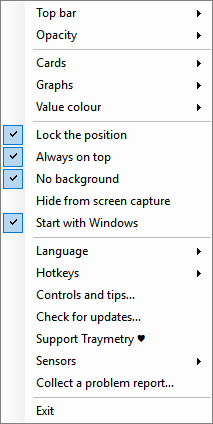

# Traymetry

Traymetry — компактный монитор ресурсов Windows, который остаётся поверх окон,
масштабируется от одной цифры до подробной панели и не требует фирменной
утилиты производителя компьютера или охлаждения.

[**Скачать последнюю сборку**](https://github.com/Alsoilia/Traymetry/releases)
· [English](README.md)


## Что показывает

- FPS игры или приложения, которое сейчас на переднем плане.
- CPU: температура, загрузка, частота и мощность, когда датчики доступны.
- GPU: температура, загрузка, частота, мощность и занятая видеопамять.
- Сеть: текущая скорость загрузки и отдачи.
- Оперативная память: занятый объём и частота модулей.
- Накопители: занятое место с выбором отображаемого диска.

Данные CPU/GPU читаются через открытый проект LibreHardwareMonitor, а память,
диски и сетевой трафик — также через стандартные API Windows. Traymetry не
подключается к программам производителей и работает самостоятельно.

## Управление



- Тяните за края или уголки, чтобы менять размер. Карточки перестраиваются с
  приоритетом CPU → GPU → память → сеть.
- Кнопка прокрутки меняет текущий показатель или порядок карточек.
- Значок `%` открывает отдельный ползунок прозрачности поверх окна.
- Кнопка фона включает режим отображения без задней подложки.
- Пин фиксирует окно и отключает все элементы, кроме самой кнопки пина.
- Нижняя полоска раскрывает максимальную статистику и возвращает точный
  предыдущий размер и положение.
- Треугольник скрывает окно в область уведомлений.
- Правый клик открывает меню, в котором можно выйти из приложения.

Окно не показывается в `Alt+Tab`, не может потеряться за внешней границей
монитора и свободно переносится между несколькими экранами.

Размер, положение, прозрачность, режим без фона, закрепление и состояние верхней
панели сохраняются между перезапусками. Это относится и к автоматическому
скрытию панели при уменьшении окна.

## Обновления

Traymetry не устанавливает обновления без разрешения. Не чаще одного раза в
сутки приложение в фоне проверяет GitHub Releases; ручная проверка доступна в
контекстном меню. Перед заменой EXE сверяется SHA-256 из API GitHub, текущий файл
сохраняется как резервная копия, а замена выполняется атомарно. Для обновления
системного сервиса Windows может один раз показать UAC.

## Конфиденциальность

Traymetry не отправляет показания оборудования, список процессов или другую
телеметрию. Сетевые обращения выполняются только для проверки релизов Traymetry
и, при явном согласии на первичную настройку датчиков, загрузки официального
PawnIO. Исходный код этих операций открыт в репозитории.

<a id="support-traymetry"></a>

## Поддержать Traymetry

Traymetry остаётся бесплатной и открытой. Если программа пригодилась,
[пожертвование](https://boosty.to/traymetry/donate) идёт на разработку
интерфейса, интеграцию датчиков, тестирование разных конфигураций, исправление
ошибок и выпуск обновлений.

## Запуск

Готовая сборка состоит из одного файла `Traymetry.exe`: библиотека датчиков и
её зависимости встроены внутрь. Поддерживается
64-битная Windows 10/11 на процессоре Intel или AMD с .NET Framework 4.7.2 или новее.

Для низкоуровневых датчиков CPU LibreHardwareMonitor 0.9.6 использует драйвер
PawnIO. Без него температура и мощность CPU могут быть недоступны независимо от
прав запуска. При первом запуске Traymetry объясняет назначение драйвера и после
явного согласия загружает официальный подписанный установщик из GitHub Release
PawnIO 2.2.0 и запускает его через UAC. Перед запуском проверяются закреплённый
SHA-256 и сертификат издателя. Для первичной настройки нужен интернет; сам
установщик не входит в публичную сборку Traymetry. Последующие запуски не
требуют прав администратора. При отказе остальные доступные показатели продолжают
работать.

Собственный сервис датчиков устанавливается в `C:\Program Files\Traymetry`, защищается
системными правами доступа и автоматически обновляется вместе с EXE. Удалить его можно
через правое меню Traymetry: **«Удалить системный сервис датчиков…»**. Сам драйвер PawnIO
после этого остаётся установленным, поскольку его могут использовать другие программы;
при необходимости он удаляется отдельно через «Установленные приложения» Windows.

Если температура видна только при запуске от администратора, выберите в правом меню
**«Проверить и починить датчики…»** и один раз подтвердите UAC. После восстановления
сама Traymetry должна запускаться в обычном режиме.

## Сборка из исходников

Для воспроизводимой однофайловой сборки используйте 64-битную Windows и
встроенный компилятор .NET Framework:

```powershell
powershell -NoProfile -ExecutionPolicy Bypass -File .\build.ps1
```

Короткий вариант — `build.cmd`. Проверенный переносимый архив создаётся командой:

```powershell
powershell -NoProfile -ExecutionPolicy Bypass -File .\package-preview.ps1 `
  -PackageName Traymetry-win-x64
```

Все встраиваемые библиотеки закреплены по SHA-256 в `build.ps1`, и сборка не
завершается, если хоть одна сдвинулась. GitHub Actions повторяет ту же сборку и
прогоняет самотесты на каждый push.

## Лицензия

Исходный код Traymetry распространяется по лицензии MIT. Сведения о
LibreHardwareMonitor и его зависимостях находятся в
[`THIRD-PARTY-NOTICES.md`](THIRD-PARTY-NOTICES.md).

Архитектурные границы и правила замены внешних движков описаны в
[`docs/ARCHITECTURE.md`](docs/ARCHITECTURE.md).

Процесс безопасного выпуска, настройка ключа обновлений и проверка артефактов
описаны в [`docs/RELEASING.md`](docs/RELEASING.md).
